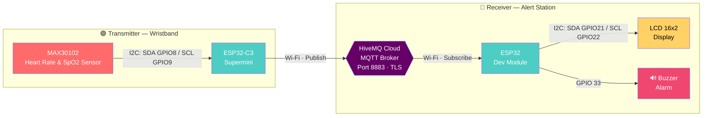

<div align="center">


<br/>


</div>

> อุปกรณ์รัดข้อมืออัจฉริยะสำหรับติดตามอัตราการเต้นของหัวใจ (BPM) และระดับออกซิเจนในเลือด (SpO2) แบบ Real-time พร้อมระบบแจ้งเตือนภัยผ่านหน้าจอ LCD และ Buzzer ออกแบบมาเฉพาะสำหรับกลุ่มผู้ใช้อายุ 10–20 ปี

<br/>

## 📖 Table of Contents

| | | |
|---|---|---|
| [📌 Overview](#-overview) | [🏗 System Architecture](#-system-architecture) | [📦 Hardware Components](#-hardware-components) |
| [🔌 Wiring Guide](#-detailed-circuit-wiring-guide) | [📊 Health Logic](#-health-logic--alert-thresholds) | [📐 3D Case Design](#-3d-case-design--dimensions) |
| [🛠 Software](#-software--dependencies) | [⚙️ Installation](#️-installation--setup) | [🩹 Troubleshooting](#-troubleshooting) |

<br/>

## 📌 Overview

โปรเจกต์นี้เป็นระบบเฝ้าระวังสุขภาพขนาดพกพา (Wearable IoT Device) แบ่งการทำงานออกเป็น 2 ส่วนหลัก:

| ส่วนประกอบ | หน้าที่ |
|---|---|
| 🟢 **Transmitter** (สายรัดข้อมือ) | เก็บข้อมูลสัญญาณชีวภาพจากเซนเซอร์ **MAX30102** ประมวลผลผ่าน **ESP32-C3 Supermini** และส่งข้อมูลขึ้น **HiveMQ Cloud** ผ่านโปรโตคอล **MQTT** (TLS/SSL Encryption) |
| 🔵 **Receiver** (สถานีรับแจ้งเตือน) | ดึงข้อมูลจาก MQTT Broker มาแสดงผลบนหน้าจอ **LCD 16x2 I2C** และส่งเสียงเตือนผ่าน **Buzzer** หากค่าสุขภาพไม่อยู่ในเกณฑ์ปกติ |

<br/>

## 🏗 System Architecture

การทำงานของระบบเป็นการรับส่งข้อมูลทางเดียวจากสายรัดข้อมือไปยังสถานีแจ้งเตือน:



* **ฝั่งส่ง (Transmitter):** เซนเซอร์วัดค่าส่งข้อมูลผ่านโปรโตคอล I2C เข้าสู่บอร์ด ESP32-C3 Supermini จากนั้นส่งค่า BPM และ SpO2 ออกไปทาง Wi-Fi เชื่อมต่อไปยัง HiveMQ Cloud บนพอร์ต 8883 (TLS Security)
* **ฝั่งรับ (Receiver):** บอร์ด ESP32 Dev Module ต่อ Wi-Fi เข้าไปดึงข้อมูล (Subscribe) จาก HiveMQ Cloud มาประมวลผลตามเกณฑ์อายุ 10–20 ปี เพื่อสั่งการแสดงผลบนหน้าจอ LCD 16x2 และขับเสียงออกทาง Buzzer

<br/>

## 📦 Hardware Components

<table>
<tr>
<td width="50%" valign="top">

### 🟢 Transmitter Unit
*(ชุดสายรัดข้อมือ)*

| Component | Model |
|---|---|
| 🧠 Microcontroller | ESP32-C3 Supermini |
| ❤️ Health Sensor | MAX30102 (HR + SpO2) |
| 🔋 Battery | Li-Po 3.7V 2000mAh |
| ⚡ Charger | TP4056 Type-C w/ Protection |
| 🔺 Booster | DC-DC Step-Up (0.9–5V → 5V) |

</td>
<td width="50%" valign="top">

### 🔵 Receiver Unit
*(ชุดสถานีแจ้งเตือน)*

| Component | Model |
|---|---|
| 🧠 Microcontroller | ESP32 Dev Module (30-pin) |
| 🖥️ Display | LCD 16x2 I2C (`0x27`) |
| 🔊 Audio Alert | Passive/Active Buzzer |

</td>
</tr>
</table>

<br/>

## 🔌 Detailed Circuit Wiring Guide

<details open>
<summary><b>1️⃣ Transmitter Unit Wiring (ฝั่งสายรัดข้อมือ)</b></summary>
<br/>

**⚡ Power Management**

| From | Pin | → | To | Pin |
|---|---|---|---|---|
| Li-Po Battery (3.7V) | `+` | → | TP4056 | `BAT+` |
| Li-Po Battery (3.7V) | `−` | → | TP4056 | `BAT-` |
| TP4056 | `OUT+` | → | Step-Up Converter | `VIN+` |
| TP4056 | `OUT-` | → | Step-Up Converter | `VIN-` |
| Step-Up Converter | `VOUT+` | → | ESP32-C3 Supermini | `5V` |
| Step-Up Converter | `VOUT-` | → | ESP32-C3 Supermini | `GND` |

**❤️ MAX30102 Sensor**

| MAX30102 Pin | → | ESP32-C3 Pin | Note |
|---|---|---|---|
| `VIN` | → | `3.3V` | ⚠️ **ห้ามต่อไฟ 5V** |
| `GND` | → | `GND` | — |
| `SDA` | → | `GPIO 8` | I2C Data |
| `SCL` | → | `GPIO 9` | I2C Clock |

</details>

<details open>
<summary><b>2️⃣ Receiver Unit Wiring (ฝั่งสถานีรับแจ้งเตือน)</b></summary>
<br/>

**🖥️ LCD 16x2 (I2C Backpack)**

| LCD Pin | → | ESP32 Dev Module Pin | Note |
|---|---|---|---|
| `VCC` | → | `VIN (5V)` | เพื่อให้ Backlight สว่างชัดเจน |
| `GND` | → | `GND` | — |
| `SDA` | → | `GPIO 21` (D21) | I2C Data |
| `SCL` | → | `GPIO 22` (D22) | I2C Clock |

**🔊 Buzzer Module**

| Buzzer Pin | → | ESP32 Dev Module Pin |
|---|---|---|
| `+` (Signal) | → | `GPIO 33` (D33) |
| `−` (GND) | → | `GND` |

</details>

<br/>

## 📊 Health Logic & Alert Thresholds

เกณฑ์อ้างอิงระดับสุขภาพเฉพาะสำหรับกลุ่มผู้ใช้อายุ **10–20 ปี**:

| Status | BPM Range | SpO2 Range | LCD Display | Buzzer Alarm |
|:---:|:---:|:---:|:---|:---|
| ⚪ **Standby** | `0` | `0` | `Place Finger...` | Silent |
| 🟢 **Normal** | `60 – 100` | `≥ 95%` | `ST: NORMAL` | Silent |
| 🟡 **Warning** | `50–59` or `101–120` | `94% – 95%` | `ST: WARNING!` | Low Tone Beep (600 Hz) |
| 🔴 **Critical** | `< 50` or `> 120` | `< 94%` | `ST: CRITICAL!!` | High-Pitch Continuous Alarm (1200 Hz) |

<br/>

## 📐 3D Case Design & Dimensions

เคสได้รับการออกแบบด้วย **Tinkercad** จัดวางอุปกรณ์ซ้อนกันเป็น 3 ชั้น (Stacking Layout) เพื่อลดขนาดตัวเรือนให้พกพาสะดวก

| Specification | Dimension | Details |
|---|:---:|---|
| 📦 Outer Dimensions | `56.0 × 40.0 × 22.0 mm` | ขนาดเคสภายนอกทั้งหมด |
| 📥 Inner Dimensions | `52.0 × 36.0 × 18.0 mm` | รวม Tolerance 0.5 mm |
| 🧱 Wall Thickness | `2.0 mm` | ความหนาผนังพลาสติก |
| 🔵 Corner Radius | `1.0 mm` | ปรับมุมมนป้องกันการบาดข้อมือ |
| ❤️ MAX30102 Cutout | `8.0 × 6.0 mm` | ช่องเจาะฐานล่างให้ชิปแนบผิวหนัง |
| 🔌 Type-C Cutout | `11.0 × 6.5 mm` | ช่องเจาะผนังข้างสำหรับสายชาร์จ |
| ⌚ Watch Lugs | `20.5 mm` | ช่องร้อยสายนาฬิกามาตรฐาน 20 mm |

<br/>

## 🛠 Software & Dependencies

พัฒนาโปรแกรมผ่าน **Arduino IDE 2.x** ต้องติดตั้ง Libraries เพิ่มเติมดังนี้:

| Library | Author | หน้าที่ |
|---|---|---|
| `PubSubClient` | Nick O'Leary | จัดการโปรโตคอล MQTT |
| `SparkFun MAX3010x` | SparkFun | อ่านค่าจากเซนเซอร์ MAX30102 |
| `LiquidCrystal I2C` | Frank de Brabander | ควบคุมการแสดงผล LCD ผ่าน I2C |

<br/>

## ⚙️ Installation & Setup

<details>
<summary><b>ดูขั้นตอนการติดตั้งทั้งหมด (click to expand)</b></summary>
<br/>

1. **Clone repository**
   ```bash
   git clone https://github.com/your-username/esp32-health-wristband.git
   ```
2. **ติดตั้ง Board Manager** — เพิ่ม ESP32 boards URL ใน Arduino IDE (`File > Preferences > Additional Board URLs`)
3. **ติดตั้ง Libraries** ทั้ง 3 ตัวที่ระบุด้านบนผ่าน `Library Manager`
4. **ตั้งค่า Wi-Fi & MQTT credentials** ในไฟล์ `config.h` ของทั้งสองโปรเจกต์ (Transmitter / Receiver): SSID, Password, HiveMQ host, username, password
5. **Upload firmware**
   - เลือกบอร์ด `ESP32C3 Dev Module` → อัปโหลดโค้ด Transmitter
   - เลือกบอร์ด `ESP32 Dev Module` → อัปโหลดโค้ด Receiver
6. **ประกอบวงจร** ตามผังการต่อสายด้านบน แล้วเปิดใช้งานทั้งสองอุปกรณ์

</details>

<br/>

## 🩹 Troubleshooting

<details>
<summary><b>ปัญหาที่พบบ่อย (click to expand)</b></summary>
<br/>

| ปัญหา | สาเหตุที่เป็นไปได้ | วิธีแก้ |
|---|---|---|
| เซนเซอร์ MAX30102 ไม่ตอบสนอง | สาย I2C หลวม หรือจ่ายไฟ 5V ผิดพลาด | ตรวจสอบว่าใช้ไฟ 3.3V เท่านั้น และเช็คสาย SDA/SCL |
| เชื่อมต่อ Wi-Fi ไม่ได้ | SSID/Password ผิด หรือสัญญาณอ่อน | ตรวจสอบ credentials ใน `config.h` |
| MQTT connect ล้มเหลว | TLS certificate/port ไม่ถูกต้อง | ตรวจสอบว่าใช้พอร์ต 8883 และ CA certificate ของ HiveMQ ถูกต้อง |
| LCD ไม่แสดงผล | I2C address ผิด หรือ Contrast ต่ำ | ใช้ I2C Scanner sketch เพื่อยืนยัน address `0x27` |
| Buzzer ไม่ดัง | ต่อขั้วผิด หรือ GPIO ชนกับพินอื่น | ตรวจสอบว่า GPIO 33 ไม่ถูกใช้งานซ้ำ |

</details>

<br/>

## 📄 License

Distributed under the **MIT License**.

<br/>

<div align="center">

</div>
